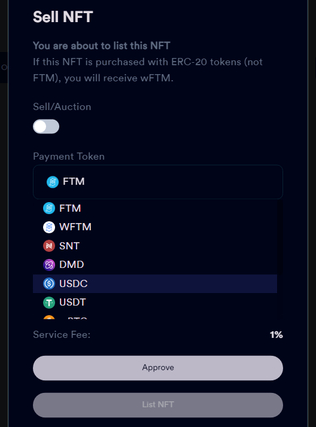
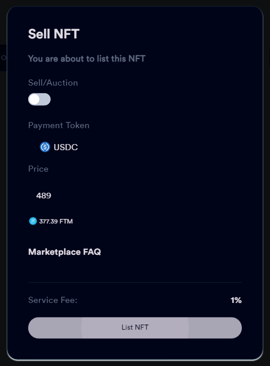
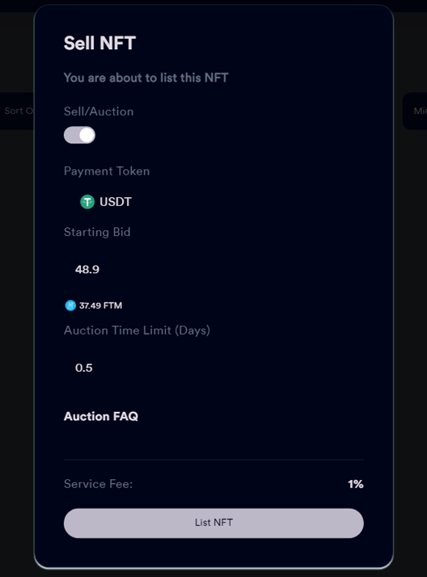

# Selling & Auctioning NFTs&#x20;

Opera House offers users the ability to list NFTs for a set price, or for auction. NFTs can be listed for FTM, or whitelisted ERC-20 tokens.

### Buying NFTs

Users have several places from which they can buy a specific NFT - the marketplace, inside collection pages, on user profiles, etc. All you need to do when you find the NFT you want to buy is to look for the "Buy Now" button. If you don't see the option to buy the NFT, that is because it isn't for sale.

#### Listing an NFT

Navigate to the NFT you want to sell either through My Profile, or by navigating to your NFT in the collection itself. Once you've located the NFT you want to sell, click the actions button on the NFT card. For the purposes of this article, the NFT card refers to the NFT displayed in the Opera House marketplace, the collection, on user profiles and marketplaces. Press the "List" button and the listing dialogue will appear.

### Selling NFTs

The Sell NFT dialogue will appear. The first option is the toggle for a standard sale, or to auction the NFT.&#x20;

.png>)

The next option is the token you wish to list the NFT for sale with. There are a number of whitelisted tokens, including USDC, wBTC, wETH and SNT. Payments made in ERC-20 tokens are received as the equivalent wFTM. The third option is the Listing Price, or the price you want to sell your NFT at. If the payment token is anything but FTM, a conversion to FTM will display below the list price.

You will be required to approve the contract interaction, per currency type, per collection. Press the approval button and complete the process in your wallet. Once this has been done, you will not be required to do so in future if you are selling additional NFTs from that collection for that currency.

If you do not see the approval button, you have already provided interaction permissions to your wallet client. Please note that depending on your screen size, you may need to scroll down on the dialogue to see the approval and listing buttons.

From there, the only thing left to do is press the List NFT button and confirm the listing via your wallet!

After an NFT has been listed for sale, you can cancel the sale at any time, either on the NFT page itself or using the Actions dialogue on the NFT in the marketplace, collection or in your profile.

### Auctioning NFTs

Use the toggle at the top of the dialogue to switch to listing the NFT for auction.

From here, the process is similar to a flat-rate sale. Choose the token you wish to accept for payment (Undertaking the necessary approvals), choose the starting bid, and set the auction time limit. The input for this is in days, so please ensure you are doing the necessary decimal conversions for listings shorter than a period of 24 hours - i.e. \~0.000694 days is one minute, \~0.0416 days is one hour, etc

#### Finalizing Auctions

Auctions can be finalized at any point in the bidding process, either through the NFT card or the NFT page itself. Either press Accept Bid via the Actions button, or on the NFT page itself. Confirm the acceptance of the bid via your wallet. Please note that due to the P2P, non-custodial nature of the Opera House marketplace, auctions are not automatically finalized and the auctioneer must accept the bid. In the event of the bidder no longer having the funds to honour their bid, the bid cannot be accepted and the auctioneer will need to either restard or cancel the auction

#### Canceling Auctions

Auctions can be canceled at any point, either through the NFT card or the NFT page itself. Confirm the cancellation via your wallet and it will no longer be listed

#### Restarting Auctions

Auctions can be restarted at any time, either through the NFT card or the NFT page itself. You may alter the reserve price or the listing time. Confirm the restart with your wallet.
